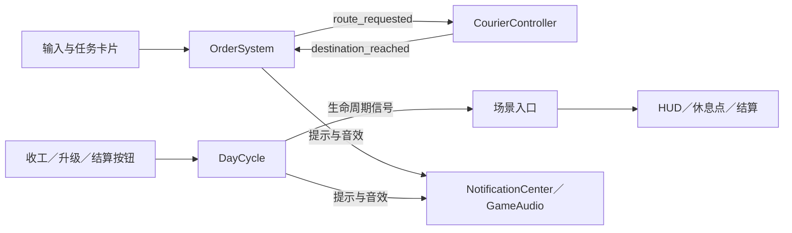

# 代码结构与维护

项目使用 Godot 4.7.2 Standard、GDScript 和 Compatibility 渲染器。`scenes/MainMenu.tscn` 是启动入口，开始游戏后进入 `scenes/Main.tscn`。

## 模块职责

`scripts/main.gd` 是游戏场景的组装入口，负责创建模块、连接信号、安排每帧更新和切换界面。玩法规则放在对应模块中。

| 模块 | 职责 |
| --- | --- |
| `core/game_config.gd` | 地图投影、订单颜色、骑手出生点等共享常量 |
| `core/game_state.gd` | 本局的时间、资金、升级、订单、任务和骑手状态；重开默认值 |
| `gameplay/map_model.gd` | 地图与道路地点数据、两套路网、世界与屏幕坐标转换 |
| `gameplay/order_system.gd` | 派单、接单、取送顺序、等待、超时、奖励与处罚 |
| `gameplay/courier_controller.gd` | 寻路、移动、加速能量和抵达事件 |
| `gameplay/day_cycle.gd` | 时钟、慢时、天气选择、收工、升级、跨天与重开 |
| `gameplay/input_controller.gd` | 地图点击、任务拖动与悬停、键盘操作 |
| `presentation/game_assets.gd` | 共用图片和字体引用 |
| `presentation/map_renderer.gd` | 地图、天气、路线、订单和骑手的绘制 |
| `ui/game_hud.gd` | HUD 背景、资源条、背包和收工卡片 |
| `ui/task_list_view.gd` | 任务卡片布局与刷新，发出拖动和悬停事件 |
| `ui/rest_screen.gd` | 每天之间的统计与升级界面，发出购买和下一天请求 |
| `ui/end_summary.gd` | 最终统计、评级和重开请求 |

以上路径相对于 `scripts/`。既有的 `game_audio.gd`、`notification_center.gd`、`weather_atmosphere.gd`、`road_graph.gd`、`visual_road_graph.gd`、`day_close_panel.gd` 和 `end_rating.gd` 继续负责各自的音频、提示、天气、寻路、收工展示和评级规则。启动菜单由 `main_menu.gd` 管理。

在线功能独立在 `scripts/online/`：`playfab_config.gd` 读取公开配置，`local_online_profile.gd` 管理本机身份，`playfab_transport.gd` 负责 HTTPS/JSON，`playfab_client.gd` 管理会话和客户端接口，`leaderboard_controller.gd` 连接异步操作与 `ui/leaderboard_view.gd`。`OnlineService` 是跨菜单和游戏场景的 Autoload，只保存在线会话，不持有本局玩法状态。配置和验证限制见 [PlayFab 接入说明](playfab.md)。

## 状态、依赖与事件

每个游戏场景持有独立的 `GameState`。玩法模块通过构造函数接收明确的状态或地图依赖；本局状态不使用全局 Autoload。`GameState` 只保存数据，不持有界面、音频或场景引用。

模块之间的事件在 `main.gd` 集中连接：



界面发出玩家请求，玩法模块决定费用、限制和结果。比如休息点的按钮发出 `purchase_requested(kind)`，`DayCycle.purchase()` 扣费并更新状态，再通过 `changed` 刷新展示。订单系统只发出寻路请求，不依赖骑手或界面对象。

轻量的玩法和绘制模块使用 `RefCounted`；界面和音频使用场景子节点。释放场景时，两类对象随场景释放。新增依赖时避免模块互相持有强引用；生命周期回归会检查这一点。

## 更新与绘制顺序

`main.gd._process()` 保留现有的先后顺序：计算慢时倍率 → 更新天气与音乐 → 推进时钟 → 更新加速能量 → 结束等待与处理订单超时 → 检查自动收工 → 移动骑手 → 生成订单 → 刷新展示并启动可执行的下一项任务。休息和结算期间暂停这些玩法更新。

`refresh_views()` 汇总等待提示、HUD、休息点和下一项任务的启动；不要把新的计时、奖励或处罚规则放进去。`announce_day()` 负责本局首次天气介绍与普通开工提示。

绘制顺序为地图 → 天气 → 路线 → 订单标识 → 骑手 → HUD；最终结算时在 HUD 上方绘制暗幕，再显示结算面板。天气不能遮挡订单、路线或操作界面。

## 常见修改入口

| 想修改什么 | 从哪里开始 |
| --- | --- |
| 派单概率、接单时限、餐厅等待、配送奖惩 | `gameplay/order_system.gd` |
| 骑手速度、加速消耗、路线执行 | `gameplay/courier_controller.gd` |
| 一天的时间、天气概率、升级费用和跨天重置 | `gameplay/day_cycle.gd` |
| 地图地点、坐标和路网 | `data/map.json`、`data/visual_waypoints.json` 与 `gameplay/map_model.gd`；同时检查两套寻路与视觉道路是否一致 |
| 天气动画的形状、强度和频率 | `weather_atmosphere.gd` |
| 背包和资源条 | `ui/game_hud.gd` |
| 任务卡片样式 | `ui/task_list_view.gd` |
| 休息点与结算排版 | `ui/rest_screen.gd`、`ui/end_summary.gd` |
| 提示内容、首次介绍、去重规则 | `notification_center.gd` |
| 启动菜单背景、镜头和按钮 | `main_menu.gd` |

生产代码不依赖 `tests/`。确定性测试场景的准备函数集中在 `tests/game_fixture.gd`，测试通过 `game.state`、`game.map_model`、`game.order_system`、`game.courier`、`game.day_cycle` 等明确接口操作场景。

## 验证

从项目根目录执行：

```powershell
.\tools\verify_godot.ps1 -GodotPath 'C:\path\to\Godot_console.exe' -ImportAssets
```

该命令检查版本同步，递归解析 `scripts/` 下的全部脚本，并运行玩法与道路、音频、提示、天气、菜单、架构、PlayFab 和启动回归。架构回归额外覆盖多实例状态隔离、界面到玩法的信号链路、跨天与重开，以及模块释放。PlayFab 回归使用模拟服务，不连接真实后台。

需要查看天气画面时，可用带窗口的 Godot 执行：

```powershell
godot --path . --script res://tests/weather_regression_test.gd -- --capture
```

截图保存到 `tests/weather_*.png`，用于检查效果和地图可读性；截图与本地日志已由 Git 忽略。新增脚本的 `.gd.uid` 由 Godot 生成，并随源码提交。
